

    <h1>:video_game: VR FPS Shooting Game (Monster Killer)</h1>

 

`*Git repository 용량 제한 문제로 Assets 파일들만 커밋되어 있습니다.`

## 목차

1. [**게임 소개**](#1)
1. [**프로젝트 진행 배경**](#2)
1. [**기술 스택**](#3)
1. [**데모 영상**](#4)
1. [**게임 맵**](#5)
1. [**게임 플레이 TIP**](#6)
1. [**게임 신**](#7)
1. [**주요 코드**](#8)
1. [**개발 팀 소개**](#9)
1. [**개발 진행 일정**](#10)

 

## 💁 게임 소개

| **게임명**      | Monster Killer                                                |
| :-------------- | :------------------------------------------------------------ |
| **게임 장르**   | FPS (First-Person Shooter)                                    |
| **플레이 시간** | 약 5분 ~ 8분                                                  |
| **게임 목표**   | 플레이어를 향해 다가오는 몬스터를 모두 섬멸하라               |
| **게임 특징**   | 텔레포트 기능을 통해 몬스터의 공격을 피해가며 처치할 수 있다. |

 

## 📰 프로젝트 진행 배경

현재 5세대 이동통신 `5G의 등장으로 대용량 데이터의 신속한 처리가 가능`해짐에 따라 VR 기술을 활용한 시장은 점점 커지고 있습니다. 이에 따라 마이크로소프트, 구글 등 글로벌 ICT기업들의 `VR 시장 주도권을 확보 경쟁이 치열`합니다.

우리나라 역시 VR 시장을 확보를 위해 SKT, KT, LG U+ 등이 앞다퉈 다양한 VR 콘텐츠들을 선보이고 있는 가운데 VR 시장에서 `가장 인기있는 분야인 게임 분야`에 대한 VR 콘텐츠 제작을 진행하게 되었습니다.

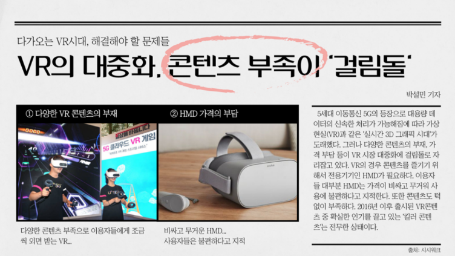

 

## 🛠 기술 스택

|  |  |
| :----------------------------------------------------------------------------------------------------------------------------------------------: | :-------------------------------------------------------------------------------------------------------------: |
|                                                                        C#                                                                        |                                                      Unity                                                      |

 

## 🖥 데모 영상

[**🔗 데모 영상 바로가기 Click !**](https://youtu.be/fxtkpmWUT0A) 👈

> 새 창 열기 방법 : CTRL+click (on Windows and Linux) | CMD+click (on MacOS)

 

## 📃 게임 맵

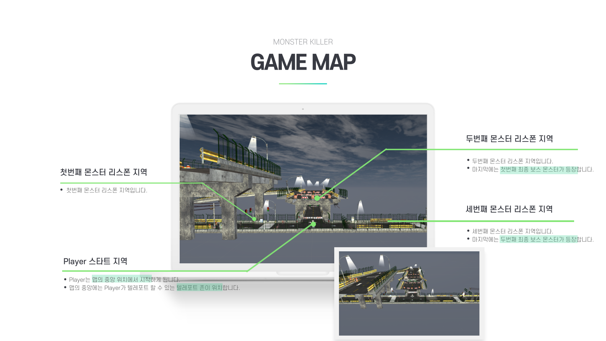

 

## 💡 게임 플레이 TIP

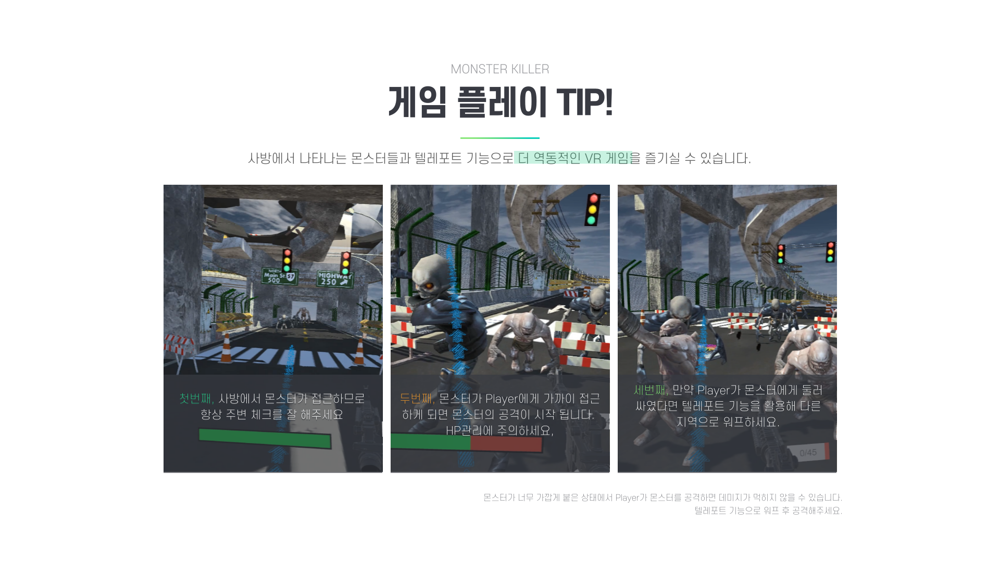

 

## 🎮 게임 신

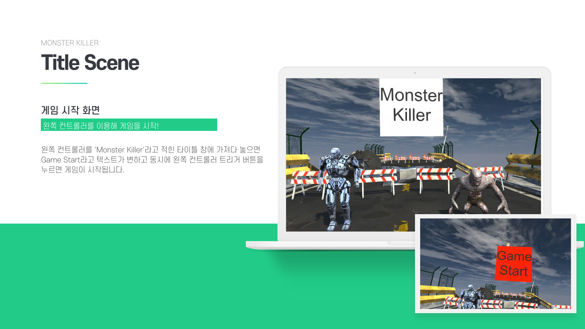

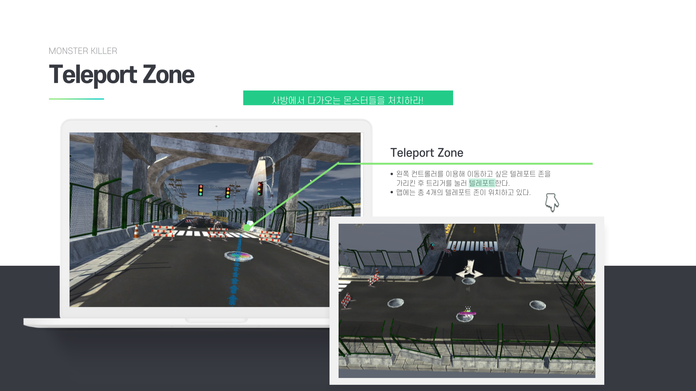

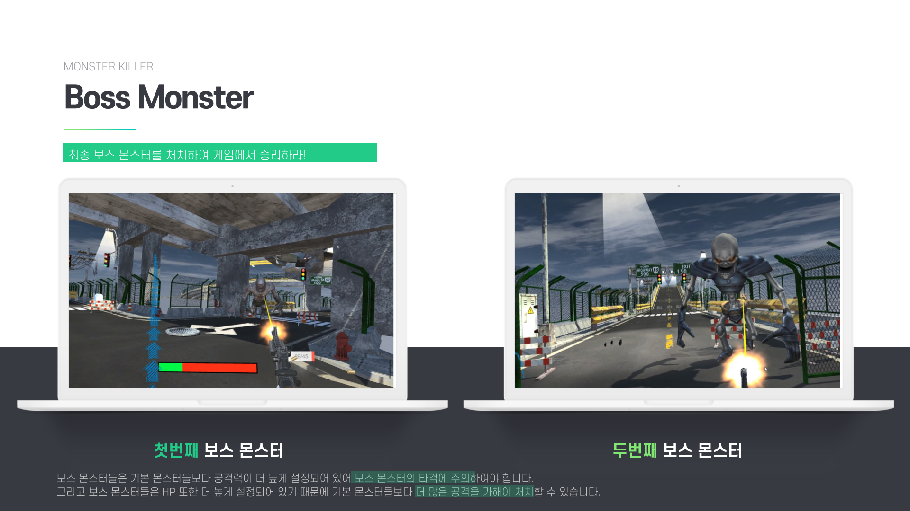

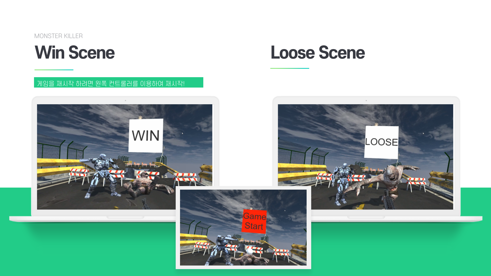

 

## 💻 주요 코드

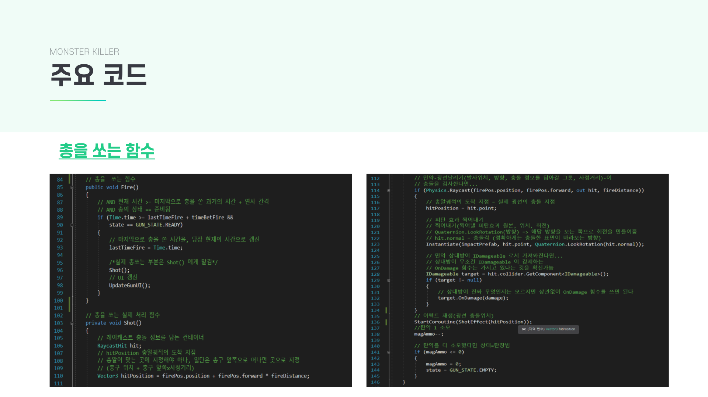

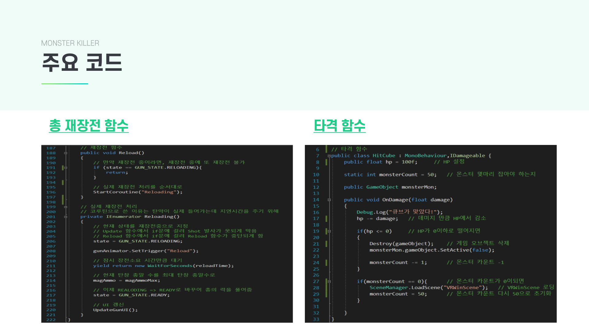

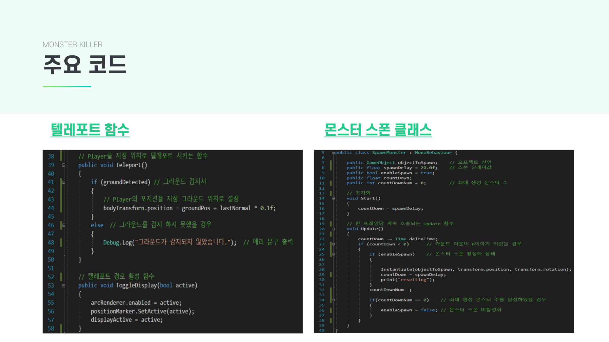

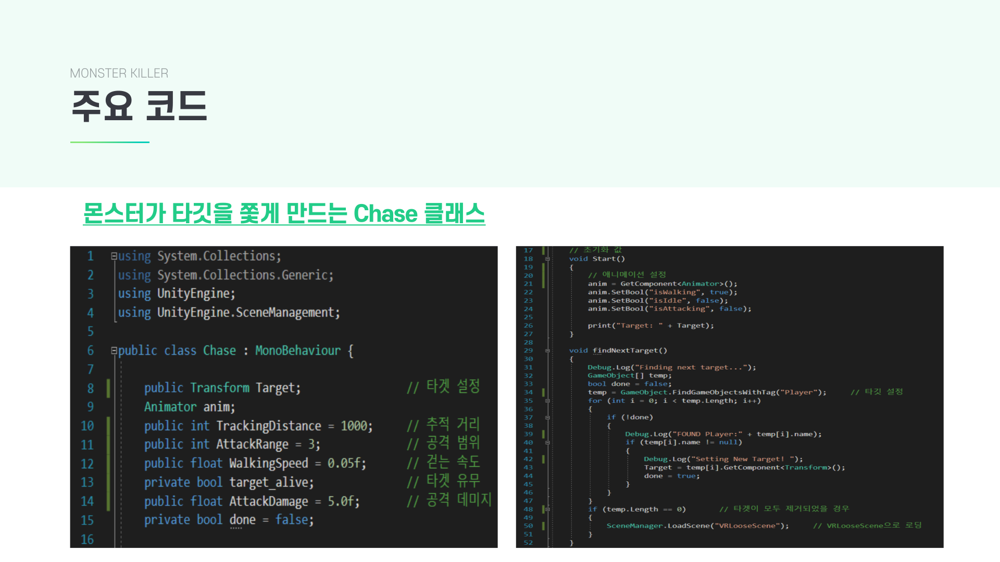

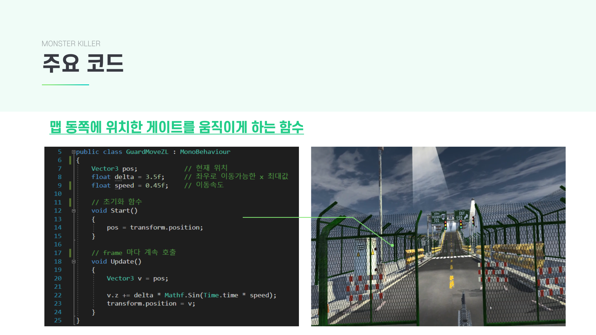

 

## 👪 개발 팀 소개

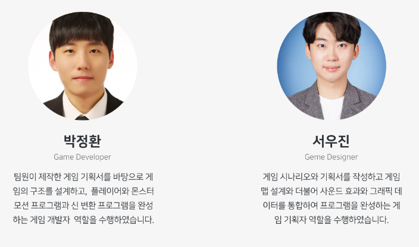

 

## 📅 개발 진행 일정

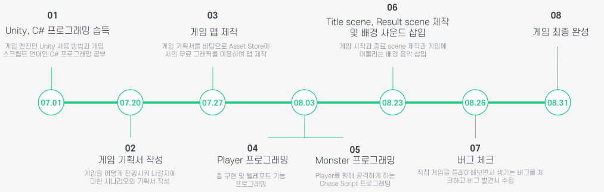
